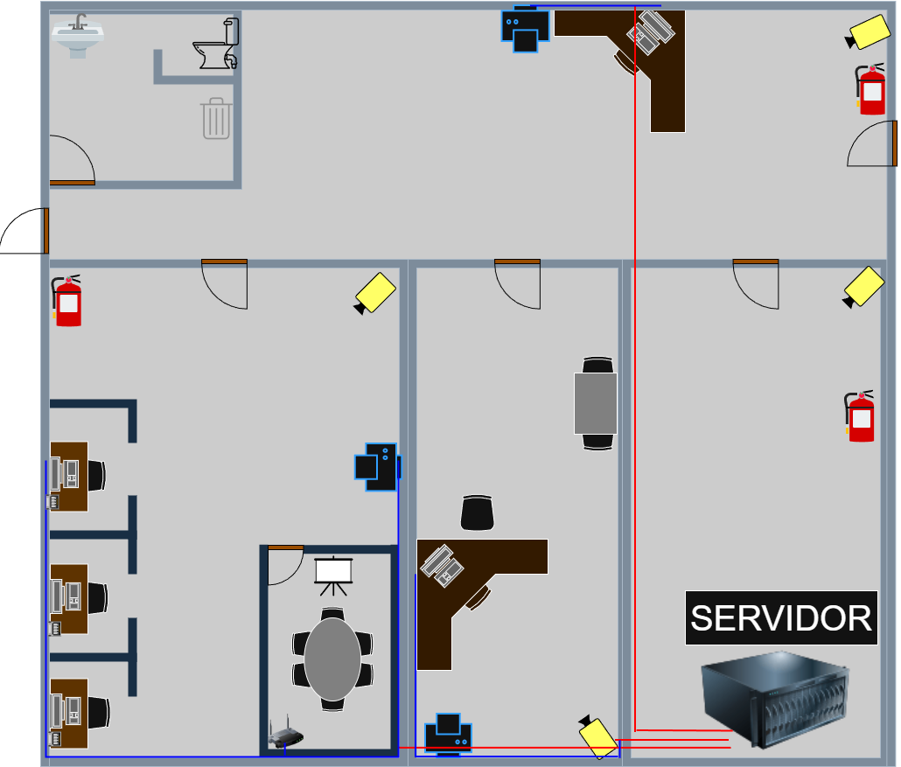
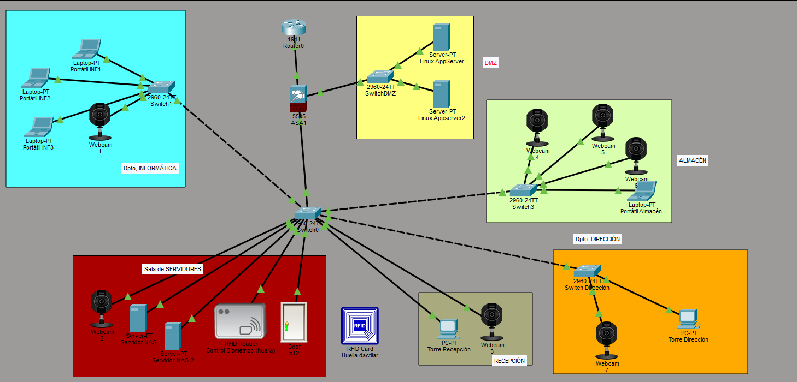
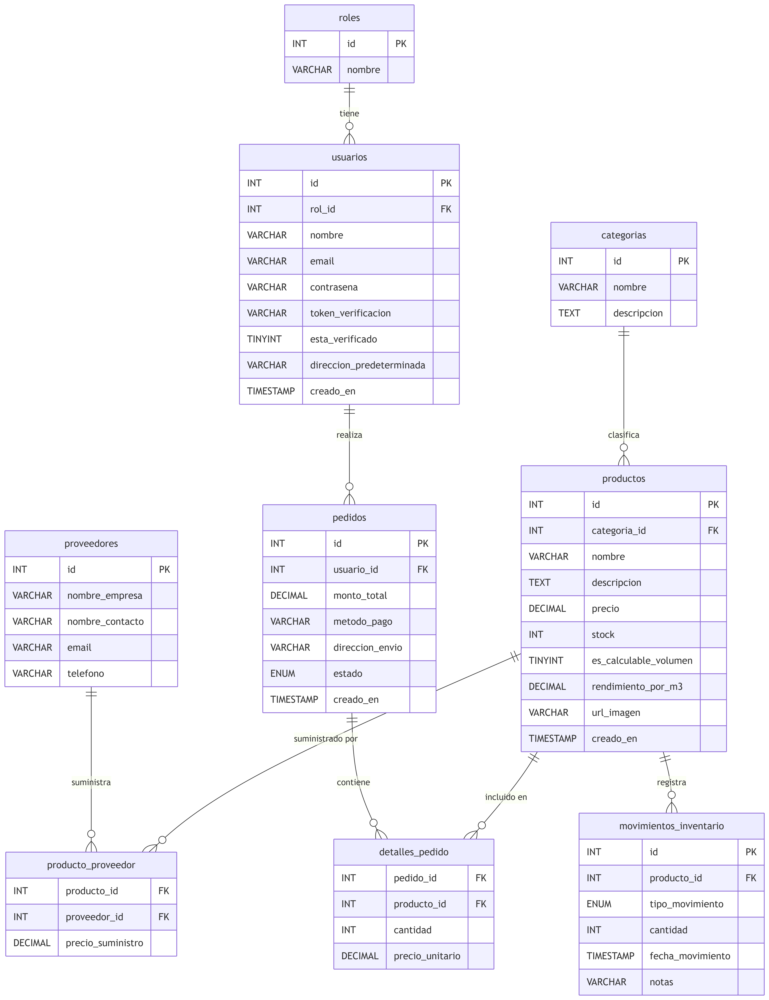

# 🌿 Ecobric - Infraestructura de Servidores y Plataforma Web B2B/B2C


> **Ecobric** es una plataforma integral especializada en la venta de productos y materiales de construcción ecológicos y sostenibles. Este proyecto abarca desde el despliegue de una infraestructura de red segura y de alta disponibilidad hasta el desarrollo completo de un eCommerce con panel ERP automatizado.

---

## 🏢 Sede e Instalaciones
El núcleo físico de Ecobric se sitúa en una nave industrial de dos plantas (oficina y almacén). La seguridad física está garantizada mediante control de acceso biométrico a la sala de servidores, sistemas de alimentación ininterrumpida (SAI) y videovigilancia CCTV.



---

## 🛠️ Tecnologías y Herramientas

El proyecto se sostiene sobre un stack moderno y centralizado:

*   **Frontend:** HTML5, CSS3, JavaScript.
*   **Backend & IA:** PHP (PDO, PHPMailer) y Python (Automatización y API Gemini).
*   **Base de Datos:** MariaDB.
*   **Infraestructura & Contenedores:** Docker, NGINX Proxy Manager, Keepalived.
*   **Monitorización:** Prometheus, Grafana, Uptime Kuma.
*   **Sistemas Operativos:** Windows Server 2022, Ubuntu Server, Windows 10 (Cliente).

## 📚 Documentación Técnica Completa
Para una inmersión profunda en el código fuente, la lógica de los scripts y la documentación de las funciones, puedes visitar la Wiki interactiva autogenerada del proyecto:
👉 **[Ver Documentación Técnica en DeepWiki](https://deepwiki.com/manuelmariscalmunoz/ecobric-server-infrastructure)**

---

## 📂 Estructura del Proyecto
El repositorio está organizado de la siguiente manera para separar la infraestructura del código web:
```text
📦 ecobric-server-infrastructure
 ┣ 📂 src/                  # Código fuente de la web (HTML, CSS, JS, PHP)
 ┃ ┣ 📂 config/             # Conexiones PDO y variables
 ┃ ┣ 📂 assets/             # Imágenes y estilos
 ┃ ┗ 📜 index.php           # Punto de entrada
 ┣ 📂 dev_tools/            # Scripts de Python (Generación de datos, reportes, IA)
 ┣ 📜 docker-compose.yml    # Orquestación de servicios (MariaDB, Grafana, Nginx)
 ┣ 📜 sincronizar.sh        # Script Bash de sincronización HA (rsync)
 ┗ 📜 README.md             # Documentación principal
---

## 🏗️ Arquitectura de la Infraestructura

Nuestra red está segmentada mediante VLANs y un firewall Ubiquiti para aislar los servidores de los ordenadores del almacén e invitados, garantizando la máxima seguridad mediante políticas de denegación por defecto. 



```markdown
### 🔄 Sincronización en Alta Disponibilidad (HA)
Para garantizar la persistencia de datos en caso de caída del servidor principal, el sistema cuenta con un **script automatizado (Cron + Rsync)** que realiza volcados seguros de la base de datos MariaDB y sincroniza los volúmenes esenciales hacia el servidor de respaldo (Standby Frío) cada minuto, excluyendo cachés temporales para evitar problemas de permisos.

La topología se compone de los siguientes nodos:
1.  **Ecobric_DC1 y Ecobric_DC2 (Windows Server 2022):** Operan como un clúster activo/pasivo. Gestionan el Active Directory (AD), el servicio DNS local y actúan como NAS replicado en tiempo real (DFS-R) para almacenar backups y archivos corporativos.
2.  **Ubuntu Server (Linux):** Servidor aislado de la red de usuarios que aloja el ecosistema Docker. Aquí reside la base de datos, la página web, los certificados SSL (NGINX) y las herramientas de monitorización.
3.  **Equipo Cliente (Windows 10):** Entorno de trabajo preconfigurado para los empleados.

---

## 💻 Funcionamiento de la Plataforma Web

La página web funciona como tienda y como ERP (Enterprise Resource Planning) de gestión:

*   **🛒 eCommerce B2B/B2C:** Catálogo de productos con filtros, cálculo de materiales volumétricos y carrito de compra que descuenta el stock en tiempo real.
*   **🔐 Panel ERP de Administración:** Dashboard protegido para ver analíticas, reabastecer stock mediante pedidos a proveedores y generar balances contables mensuales en Excel automáticamente.
*   **🤖 Asistente de IA (EcoBot):** Chatbot integrado alimentado por IA (Gemini) para resolver dudas sobre bioconstrucción y presupuestos.
*   **🌍 Soporte Multilingüe:** Traducción dinámica de la página para clientes y contratistas internacionales.

### 🗄️ Esquema de la Base de Datos
Todo el sistema logístico y de usuarios está respaldado por una base de datos relacional robusta en MariaDB que consta de 9 tablas principales e interconectadas:



---

## 🚀 Guía de Despliegue Rápido (Simulacro)

El proyecto está preparado para ser descargado y desplegado de forma rápida importando las máquinas virtuales.

### Paso 1: Descargar las Máquinas Virtuales (.ova)
Puedes descargar el entorno completo preconfigurado desde el siguiente enlace:
👉 **[Descargar Archivos OVA desde Google Drive](https://drive.google.com/drive/folders/1DI0l7FpfX5Dk2sb77s3mNrPqgFvYtv3O?usp=sharing)**
En total todas las máquinas activas consumen un total máximo de 16 Gb de memoria RAM y unos 10 núcleos del procesador su equipo


### Paso 2: Orden de Arranque (¡Importante!)
Para que el dominio, la red y la resolución de nombres funcionen correctamente, las máquinas deben iniciarse en **VirtualBox** o **VMware** en este orden estricto:

1.  ▶️ Iniciar **Ecobric_DC1** (Esperar a que levante el servidor y el Active Directory).
2.  ▶️ Iniciar **Ecobric_DC2** (Servidor de respaldo).
3.  ▶️ Iniciar **Appserver y Appserver2** *(Modo Headless / Sin interfaz)*. (Esperar unos minutos a que Docker levante todos los contenedores).
4.  ▶️ Iniciar **Cliente_Windows10**.

---

## 🖥️ Uso del Equipo Cliente (Administración)

Una vez iniciado el **Cliente_Windows10**, accederás al escritorio preconfigurado del empleado de informática, con accesos directos para administrar toda la infraestructura:

*   🌐 **Web Ecobric:** Acceso directo a la tienda y al ERP (Login admin: `ecobric2406@gmail.com`, Contraseña: Rajang_Rakna12).
*   📊 **Grafana & Prometheus:** Paneles visuales de monitorización de recursos (CPU, RAM, red).
*   ⏱️ **Uptime Kuma:** Panel de alertas y estado (Status Page) de los servidores en tiempo real.
*   🔒 **Nginx Proxy Manager:** Gestor de redirecciones y certificados SSL de la intranet.
*   🗄️ **phpMyAdmin:** Interfaz web para consultar y administrar la base de datos MariaDB.
*   💻 **PuTTY:** Acceso rápido por SSH al Ubuntu Server para mantenimiento por terminal.
*   🖥️ **Conexión a Escritorio Remoto (RDP):** Accesos configurados para entrar directamente a DC1 y DC2.

---

## 📄 Licencia
Este es un proyecto académico y de demostración Open Source. Siéntete libre de descargarlo, explorarlo y aprender de la arquitectura.

---
*Desarrollado por [Manuel Mariscal Muñoz] - I.E.S. Ribera del Tajo*